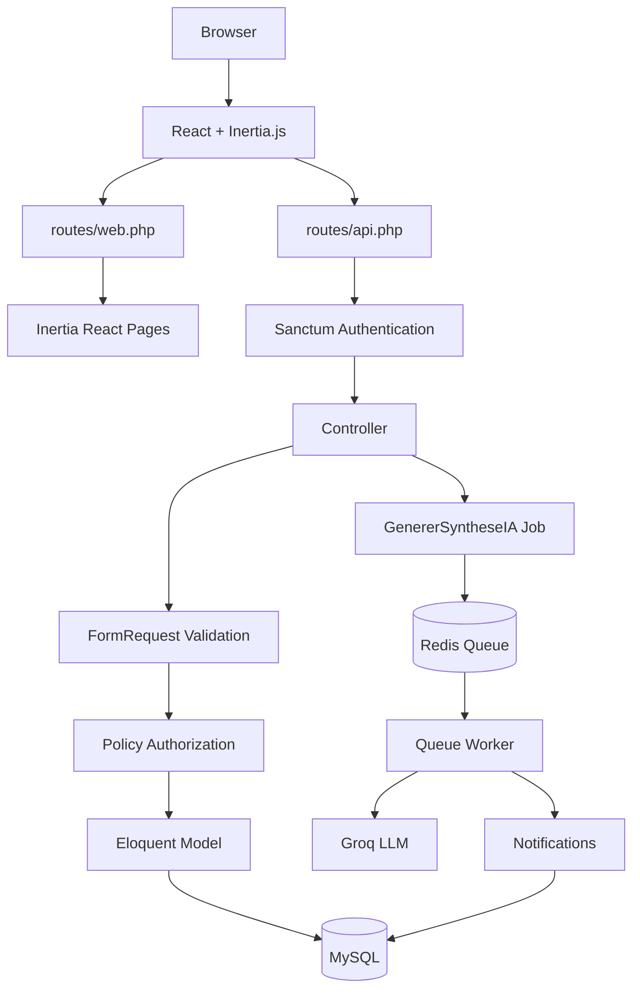

# ScolarWatch

> AI-powered school management system — Laravel 13 · React · Inertia.js

ScolarWatch helps schools manage students, classes, attendance, grades and teacher observations, and uses AI to detect students at risk of academic difficulty (**décrochage scolaire**). It bridges the gap between administrators, teachers, direction staff and parents through a single web application and a REST API.

## Table of contents

- [Features](#features)
- [Tech stack](#tech-stack)
- [Architecture](#architecture)
- [Getting started](#getting-started)
- [Seeded accounts](#seeded-accounts)
- [Configuration](#configuration)
- [API documentation](#api-documentation)
- [Testing](#testing)
- [Code quality](#code-quality)
- [CI/CD & deployment](#cicd--deployment)
- [Project structure](#project-structure)
- [Documentation & diagrams](#documentation--diagrams)
- [Project status](#project-status)

## Features

- **Authentication** — Sanctum token authentication (`POST /api/login`), rate-limited login, logout.
- **Multi-role accounts** — `admin`, `direction`, `enseignant`, `parent`.
- **Users & subjects** — user management with per-role policies, subject (`matière`) management restricted to admins.
- **Classes & students** — CRUD for classes and students, teacher-to-class assignment, `professeur principal` designation, bulk student re-assignment to a class.
- **Archiving** — soft-delete, restore and force-delete users, students and classes, individually or in bulk.
- **Academic tracking** — grades (notes), absences, lateness (retards) and teacher remarks, each with duplicate/limit validation.
- **Parent portal** — parents view their children's grades, absences, lateness and remarks via a scoped "Espace parent" API.
- **Notifications** — per-user notification inbox with read tracking.
- **AI student risk analysis** — AI-generated per-student, per-term summaries (Groq / Laravel AI) with human-in-the-loop correction and parent notification on send.
- **Health check** — `GET /api/health` reports database and Redis status.
- **API documentation** — auto-generated documentation with Scribe (HTML, OpenAPI 3 and Postman collection).
- **Docker & CI/CD** — containerized dev and prod builds, GitHub Actions CI + CD to GHCR.

## Tech stack

| Layer    | Technology |
|----------|------------|
| Backend  | Laravel 13, PHP 8.4, Laravel Sanctum, Laravel AI (Groq provider), Pest |
| Frontend | React 19, Inertia.js 3, Vite, Tailwind CSS 4, TypeScript, Wayfinder |
| Data     | MySQL 8, Redis 7 (cache + queues) |
| DevOps   | Docker & Docker Compose, GitHub Actions (CI + CD), GHCR, Nginx (prod), target platform AWS EC2 |

## Architecture

ScolarWatch is a layered Laravel application:

```
React + Inertia.js (SPA)  ──  Laravel REST API / Web  ──  MySQL 8
                                     │
                                     ├── Redis 7 (cache, queues)
                                     └── Groq LLM (risk analysis, queued jobs)
```

- The **UI** is a client-side rendered SPA served through Inertia.js.
- The **API** (`routes/api.php`) is a pure REST API secured with Sanctum tokens.
- **Queued jobs** (`GenererSyntheseIA`, notifications) run through Redis and are processed by a queue worker.
- Authorization is enforced through dedicated **policies** (users, classes, students, notes, absences, retards, remarks, notifications, AI syntheses).
- Frontend routes are wired to backend endpoints with **Laravel Wayfinder** (typed route functions).

## Getting started

### Prerequisites

- Docker & Docker Compose, **or** PHP 8.4+, Composer, Node.js ≥ 22 on the host.

### Installation (Docker)

```bash
git clone git@github.com:Dev-Lhabib/scolarwatch.git
cd scolarwatch
cp .env.example .env

docker compose up -d
docker compose exec app composer install
docker compose exec app php artisan key:generate
docker compose exec app php artisan migrate --seed
docker compose exec app php artisan queue:work &
```

`docker compose up -d` starts the application, the queue worker, MySQL, Redis and phpMyAdmin.

### Installation (local)

```bash
composer install
npm install

cp .env.example .env
php artisan key:generate
php artisan migrate --seed

npm run dev        # Vite dev server (hot reload)
php artisan serve  # app at http://localhost:8000
php artisan queue:work  # run the queue worker
```

For a production build of the frontend: `npm run build`.

### Access

| Service       | URL                          |
|---------------|------------------------------|
| Application   | http://localhost:8000        |
| API docs      | http://localhost:8000/docs   |
| phpMyAdmin    | http://localhost:8080        |
| API health    | http://localhost:8000/api/health |

## Seeded accounts

After `php artisan migrate --seed`, the following accounts are available (password: `password`):

| Role          | Username       | Email                             |
|---------------|----------------|-----------------------------------|
| Administrator | `admin`        | `admin@scolarwatch.test`          |
| Direction     | `direction`    | `direction@scolarwatch.test`      |
| Direction     | `direction2`   | `direction2@scolarwatch.test`     |
| Teacher       | `enseignant1`  | `enseignant1@scolarwatch.test`    |
| Parent        | `parent1`      | `parent1@scolarwatch.test`        |

The demo data also seeds subjects, classes, students, grades, absences, lateness, remarks, notifications and AI syntheses.

## Configuration

Key environment variables in `.env`:

| Variable            | Purpose                                              |
|---------------------|------------------------------------------------------|
| `GROQ_API_KEY`      | API key for the AI risk-analysis provider (required) |
| `QUEUE_CONNECTION`  | `redis` (production) or `sync` (testing)             |
| `MAIL_MAILER`       | `log` by default; switch to SMTP for real emails     |
| `SCRIBE_AUTH_KEY`   | Optional; token Scribe uses for live response calls  |

## API documentation

The REST API is documented with [Scribe](https://scribe.knuckles.wtf/) and served by the application:

| Resource             | URL                              |
|----------------------|----------------------------------|
| Interactive docs     | `/docs`                          |
| OpenAPI 3 spec       | `/docs.openapi`                  |
| Postman collection   | `/docs.postman`                  |

Regenerate the docs after changing endpoints or annotations:

```bash
php artisan scribe:generate
```

All endpoints are annotated in the controllers (`@group`, `@subgroup`, `@response`, `@urlParam`, `@bodyParam`, `@queryParam`); request body and validation rules are extracted automatically from the FormRequests. Every endpoint except `POST /api/login` and `GET /api/health` requires a Sanctum token (`Authorization: Bearer <token>`).

A hand-curated Postman collection is also available at `docs/postman/ScolarWatch.postman_collection.json`.

## Testing

```bash
# Whole suite
php artisan test --compact

# A single test
php artisan test --compact --filter=test_name
```

The suite (Pest) covers authentication, policies, CRUD endpoints, the AI synthesis flow, notifications, and the archive/bulk administration features. CI runs it against an in-memory SQLite database with `QUEUE_CONNECTION=sync`.

## Code quality

```bash
./vendor/bin/pint            # Laravel Pint — format PHP code
./vendor/bin/pint --test     # check only

npm run lint                 # ESLint (with --fix)
npm run types:check          # TypeScript (tsc --noEmit)
npm run format               # Prettier
```

## CI/CD & deployment

- **CI** (`.github/workflows/ci.yml`) — runs on every push/PR: full Pest test suite (PHP 8.4, Node 22, SQLite in-memory) and Laravel Pint code-style check.
- **CD** (`.github/workflows/cd.yml`) — on release tags (`v*`), builds and pushes production images to `ghcr.io/dev-lhabib/scolarwatch` (`app-*` and `nginx-*` tags, immutable per commit), after waiting for CI to pass. SSH deployment to the AWS EC2 host is the next step (Phase 2).
- **Production Dockerfile** — multi-stage build (Composer → Node → PHP-FPM runtime) producing a slim, non-root image with OPcache and a healthcheck; `docker-compose.prod.yml` consumes the GHCR images via Nginx.

## Project structure

```
app/
  Http/Controllers/     REST API controllers (annotated for Scribe)
  Http/Requests/        FormRequests (validation rules, auto-documented)
  Http/Middleware/      Inertia request handling
  Models/               Eloquent models + policies
  Notifications/        Mail notifications (décrochage alerts)
  Jobs/                 Queued jobs (GenererSyntheseIA, …)
config/
  scribe.php            Scribe configuration
database/
  factories/ migrations/ seeders/
docs/                   Specifications, models and lab reports
resources/js/           React SPA (Inertia)
routes/api.php          REST API routes (Sanctum-protected)
```

## Documentation & diagrams

The project follows the Merise methodology from conceptual data model to implementation:

```
MCD  →  MLD  →  Database migrations (Laravel)
```

### MCD — Modèle Conceptuel de Données

The MCD is the conceptual data model of the domain, built with Merise: it identifies the core entities (users, roles, classes, students, subjects, grades, absences, lateness, remarks, notifications, AI syntheses) and the relations between them, with their cardinalities.


### MLD — Modèle Logique de Données

The MLD translates the conceptual model into relational tables. It defines every table with its primary and foreign keys, ready to be implemented as Laravel migrations on MySQL.


### Technical Architecture

ScolarWatch runs as a client-side rendered SPA served through Inertia.js, backed by a Laravel REST API (Sanctum) on MySQL, with Redis for cache and queues and the Groq LLM for queued AI risk analysis.


### Application Routing Flow

ScolarWatch has two main routing paths:

1. **Web / Inertia requests** through `routes/web.php` — `Route::inertia(...)` renders the React pages of the SPA.
2. **REST API requests** through `routes/api.php` — protected by Sanctum, they power the SPA's data layer (via Wayfinder typed actions) and external API clients.

In both paths, requests flow through controllers, FormRequest validation, authorization policies and Eloquent models before reaching MySQL. Long-running work (AI synthesis generation, notifications) is dispatched to a Redis queue and processed asynchronously by a queue worker.



### Data model documents

- [`docs/mcd.md`](docs/mcd.md) — conceptual data model (MCD): the entities, attributes and binary relations with cardinalities, plus a layout guide and verification checklist.
- [`docs/mld.md`](docs/mld.md) — logical data model (MLD): all tables derived from the MCD, their primary/foreign keys and a summary of every foreign key constraint.

### Lab reports

- `docs/labs/` — per-sprint lab reports (requirements, IA experimentation, CRUD, frontend, communication).
- `docs/labs/lab-s3-coverage-audit.md` — API coverage audit of sprint 3.

### API & Postman

- `docs/postman/ScolarWatch.postman_collection.json` — hand-curated Postman collection (see also [API documentation](#api-documentation) for the live Scribe docs).

## Project status

🚧 Work in progress — developed as a backend bootcamp project (Simplon Maghreb — *Projet Fil Rouge*), following Scrum sprints. New features are added incrementally; see the lab reports in `docs/labs/` for the current milestone.
