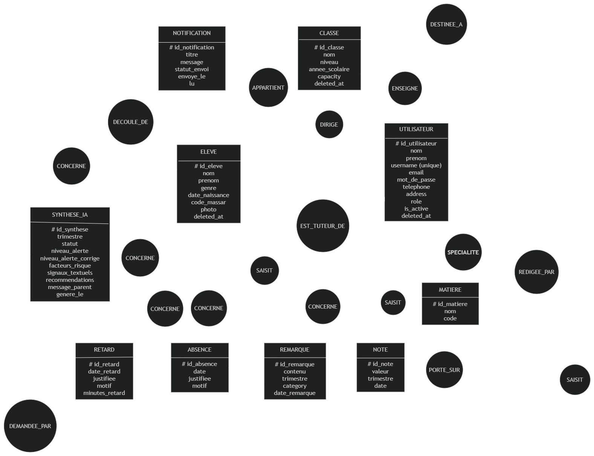
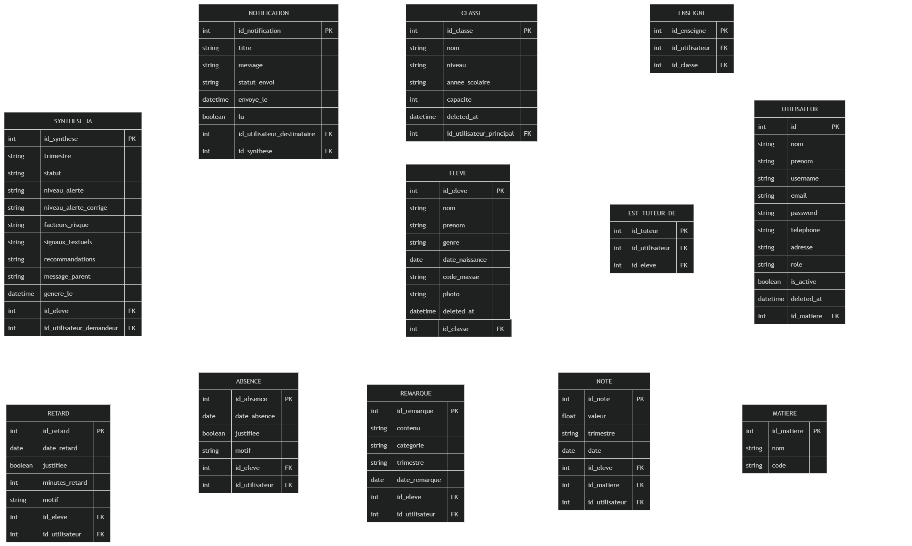
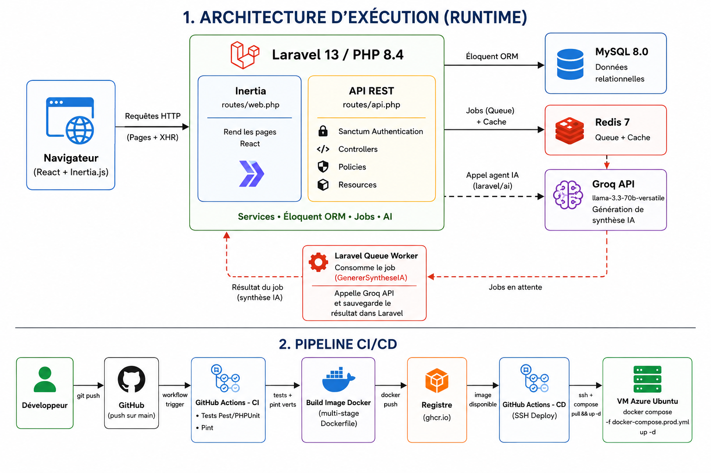
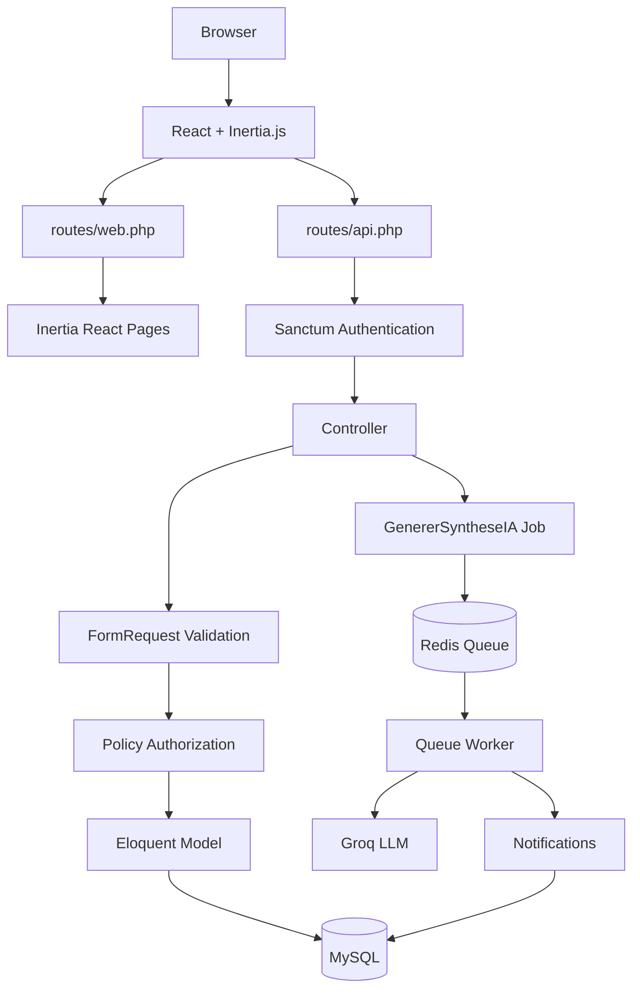

# ScolarWatch

**AI-powered academic risk detection for schools** — Laravel 13 · React 19 · Inertia.js

[](https://github.com/Dev-Lhabib/scolarwatch/actions/workflows/ci.yml)
[](https://github.com/Dev-Lhabib/scolarwatch/actions/workflows/cd.yml)
[](https://php.net)
[](https://laravel.com)
[](https://react.dev)
[](#license)

ScolarWatch gives schools a single system to track students, classes, attendance, grades and teacher observations — and uses AI to flag students at risk of academic dropout (**décrochage scolaire**) before it becomes a crisis. It's built as a bridge between administrators, teachers, direction staff, and parents, all working from the same data.

Built as the final capstone project (*Projet Fil Rouge*) for the Simplon Maghreb development bootcamp, following four Scrum sprints from data modeling to production infrastructure.

---

## Table of contents

- [Why ScolarWatch](#why-scolarwatch)
- [Features](#features)
- [Tech stack](#tech-stack)
- [Architecture](#architecture)
- [Getting started](#getting-started)
- [Seeded accounts](#seeded-accounts)
- [Configuration](#configuration)
- [API documentation](#api-documentation)
- [Testing](#testing)
- [Code quality](#code-quality)
- [CI/CD & deployment](#cicd--deployment)
- [Project structure](#project-structure)
- [Documentation & diagrams](#documentation--diagrams)
- [Project status](#project-status)
- [License](#license)

---

## Why ScolarWatch

Academic dropout rarely happens overnight — it shows up first as a pattern: a string of absences, a grade slipping, a teacher's remark repeated across terms. Catching that pattern early is hard when the signals live in different registers, spreadsheets, and memories.

ScolarWatch centralizes that data and asks an AI model to do what a busy staff often can't: read across every grade, absence, lateness, and remark for a student and surface *why* they might be struggling — with a human always reviewing and correcting the summary before it's sent to a parent.

## Features

- **Authentication** — Sanctum token authentication (`POST /api/login`), rate-limited login, logout.
- **Multi-role accounts** — `admin`, `direction`, `enseignant`, `parent`, each with scoped access.
- **Users & subjects** — user management with per-role policies; subject (`matière`) management restricted to admins.
- **Classes & students** — full CRUD for classes and students, teacher-to-class assignment, `professeur principal` designation, bulk student re-assignment.
- **Archiving** — soft-delete, restore and force-delete for users, students and classes, individually or in bulk.
- **Academic tracking** — grades (notes), absences, lateness (retards) and teacher remarks, each with duplicate and limit validation.
- **Parent portal** — parents view their children's grades, absences, lateness and remarks through a scoped "Espace parent" API.
- **Notifications** — per-user notification inbox with read tracking.
- **AI risk analysis** — per-student, per-term AI-generated summaries (Groq via Laravel AI), always reviewed and correctable by staff before being sent to parents — no AI output reaches a family unmoderated.
- **Health check** — `GET /api/health` reports database and Redis status.
- **Self-documenting API** — auto-generated docs with Scribe (interactive HTML, OpenAPI 3, Postman collection).
- **Containerized & CI/CD-ready** — production Docker images, automated tests and code-style checks on every push, automated image publishing to GHCR.

## Tech stack

| Layer    | Technology |
|----------|------------|
| Backend  | Laravel 13, PHP 8.4, Laravel Sanctum, Laravel AI (Groq provider), Pest |
| Frontend | React 19, Inertia.js 3, Vite, Tailwind CSS 4, TypeScript, Laravel Wayfinder |
| Data     | MySQL 8, Redis 7 (cache + queues) |
| DevOps   | Docker & Docker Compose, GitHub Actions (CI + CD), GHCR, Nginx (prod), target platform AWS EC2 |

## Architecture

```
React + Inertia.js (SPA)  ──  Laravel REST API / Web  ──  MySQL 8
                                     │
                                     ├── Redis 7 (cache, queues)
                                     └── Groq LLM (risk analysis, queued jobs)
```

- The **UI** is a client-side rendered SPA served through Inertia.js.
- The **API** (`routes/api.php`) is a pure REST API secured with Sanctum tokens.
- **Queued jobs** (`GenererSyntheseIA`, notifications) run through Redis and are processed by a dedicated queue worker.
- Authorization is enforced through dedicated **policies** for every resource (users, classes, students, notes, absences, retards, remarks, notifications, AI syntheses).
- Frontend routes are wired to backend endpoints with **Laravel Wayfinder** for full type safety across the API boundary.

## Getting started

### Prerequisites

- Docker & Docker Compose, **or** PHP 8.4+, Composer, Node.js ≥ 22 on the host.

### Installation (Docker — recommended)

```bash
git clone git@github.com:Dev-Lhabib/scolarwatch.git
cd scolarwatch
cp .env.example .env

docker compose up -d
docker compose exec app composer install
docker compose exec app php artisan key:generate
docker compose exec app php artisan migrate --seed
docker compose exec app php artisan queue:work &
```

`docker compose up -d` starts the application, the queue worker, MySQL, Redis and phpMyAdmin.

### Installation (local)

```bash
composer install
npm install

cp .env.example .env
php artisan key:generate
php artisan migrate --seed

npm run dev             # Vite dev server (hot reload)
php artisan serve       # app at http://localhost:8000
php artisan queue:work  # queue worker
```

For a production frontend build: `npm run build`.

### Access

| Service       | URL                               |
|---------------|------------------------------------|
| Application   | http://localhost:8000              |
| API docs      | http://localhost:8000/docs         |
| phpMyAdmin    | http://localhost:8080              |
| API health    | http://localhost:8000/api/health   |

## Seeded accounts

After `php artisan migrate --seed`, the following accounts are available (password: `password`):

| Role          | Username       | Email                             |
|---------------|----------------|-------------------------------------|
| Administrator | `admin`        | `admin@scolarwatch.test`           |
| Direction     | `direction`    | `direction@scolarwatch.test`       |
| Direction     | `direction2`   | `direction2@scolarwatch.test`      |
| Teacher       | `enseignant1`  | `enseignant1@scolarwatch.test`     |
| Parent        | `parent1`      | `parent1@scolarwatch.test`         |

Demo data also seeds subjects, classes, students, grades, absences, lateness, remarks, notifications and AI syntheses — the app is fully explorable right after seeding.

## Configuration

Key environment variables in `.env`:

| Variable            | Purpose                                              |
|---------------------|-------------------------------------------------------|
| `GROQ_API_KEY`      | API key for the AI risk-analysis provider (required) |
| `QUEUE_CONNECTION`  | `redis` (production) or `sync` (testing)              |
| `MAIL_MAILER`       | `log` by default; switch to SMTP for real emails      |
| `SCRIBE_AUTH_KEY`   | Optional; token Scribe uses for live response calls    |

## API documentation

The REST API is documented with [Scribe](https://scribe.knuckles.wtf/) and served directly by the application:

| Resource            | URL                    |
|----------------------|-------------------------|
| Interactive docs     | `/docs`                 |
| OpenAPI 3 spec       | `/docs.openapi`         |
| Postman collection   | `/docs.postman`         |

Regenerate after changing endpoints or annotations:

```bash
php artisan scribe:generate
```

Every endpoint is annotated in its controller (`@group`, `@subgroup`, `@response`, `@urlParam`, `@bodyParam`, `@queryParam`); request bodies and validation rules are extracted automatically from FormRequests. Every endpoint except `POST /api/login` and `GET /api/health` requires a Sanctum token (`Authorization: Bearer <token>`).

A hand-curated Postman collection also lives at `docs/postman/ScolarWatch.postman_collection.json`.

## Testing

```bash
# Full suite
php artisan test --compact

# Single test
php artisan test --compact --filter=test_name
```

The Pest suite covers authentication, authorization policies, CRUD endpoints, the AI synthesis flow, notifications, and archive/bulk administration. CI runs it against an in-memory SQLite database with `QUEUE_CONNECTION=sync` — no external services required.

## Code quality

```bash
./vendor/bin/pint            # Laravel Pint — format PHP
./vendor/bin/pint --test     # check only, no changes

npm run lint                 # ESLint (with --fix)
npm run types:check          # TypeScript (tsc --noEmit)
npm run format                # Prettier
```

## CI/CD & deployment

- **CI** (`.github/workflows/ci.yml`) — runs on every push/PR: full Pest suite (PHP 8.4, Node 22, in-memory SQLite) plus Laravel Pint style check.
- **CD** (`.github/workflows/cd.yml`) — on release tags (`v*`), builds and publishes production images to `ghcr.io/dev-lhabib/scolarwatch` (`app-*` and `nginx-*`, immutable per commit) once CI is green.
- **Production Dockerfile** — multi-stage build (Composer → Node → PHP-FPM runtime) producing a slim, non-root image with OPcache and a healthcheck; no secrets are baked into image layers. `docker-compose.prod.yml` consumes the published GHCR images behind Nginx.
- **Live deployment (AWS EC2)** is scoped as the next phase of the CD pipeline — see [Roadmap](#roadmap).

## Project structure

```
app/
  Http/Controllers/     REST API controllers (annotated for Scribe)
  Http/Requests/        FormRequests (validation, auto-documented)
  Http/Middleware/       Inertia request handling
  Models/                Eloquent models + policies
  Notifications/         Mail notifications (décrochage alerts)
  Jobs/                  Queued jobs (GenererSyntheseIA, …)
config/
  scribe.php             Scribe configuration
database/
  factories/ migrations/ seeders/
docs/                    Specifications, data models and lab reports
resources/js/            React SPA (Inertia)
routes/api.php           REST API routes (Sanctum-protected)
```

## Documentation & diagrams

The project follows the Merise methodology from conceptual data model to implementation:

```
MCD  →  MLD  →  Database migrations (Laravel)
```

### MCD — Modèle Conceptuel de Données

The conceptual data model: core entities (users, roles, classes, students, subjects, grades, absences, lateness, remarks, notifications, AI syntheses) and their relations, with cardinalities.



### MLD — Modèle Logique de Données

The logical model: every table with its primary and foreign keys, ready to be implemented as Laravel migrations on MySQL.



### Technical architecture



### Application routing flow

ScolarWatch has two routing paths:

1. **Web / Inertia** (`routes/web.php`) — `Route::inertia(...)` renders the React pages of the SPA.
2. **REST API** (`routes/api.php`) — Sanctum-protected, powers the SPA's data layer via Wayfinder typed actions, and serves external API clients.

Both paths flow through controllers → FormRequest validation → authorization policies → Eloquent models → MySQL. Long-running work (AI synthesis, notifications) is dispatched to a Redis queue and processed asynchronously.



### Data model documents

- [`docs/mcd.md`](docs/mcd.md) — conceptual data model: entities, attributes, binary relations, cardinalities, layout guide, verification checklist.
- [`docs/mld.md`](docs/mld.md) — logical data model: every table, its keys, and a summary of foreign key constraints.

### Lab reports

- `docs/labs/` — per-sprint lab reports (requirements, AI experimentation, CRUD, frontend, communication, Docker/CI/CD).
- `docs/labs/lab-s3-coverage-audit.md` — API coverage audit of sprint 3.
- `docs/labs/lab-s4-docker-cicd.md` — Sprint 4 infrastructure report.

### API & Postman

- `docs/postman/ScolarWatch.postman_collection.json` — hand-curated Postman collection (see also [API documentation](#api-documentation) for the live Scribe docs).

## Project status

✅ **Core platform (socle) complete** — auth, roles, CRUD, academic tracking, parent portal, AI risk synthesis, notifications, full test coverage, CI green, CD publishing to GHCR.

🔜 **Next phase** — AWS EC2 live deployment.

Built incrementally across four Scrum sprints as a bootcamp capstone (Simplon Maghreb — *Projet Fil Rouge*). See `docs/labs/` for detailed sprint-by-sprint reports.

## License

MIT — see [LICENSE](LICENSE).# ScolarWatch

**AI-powered academic risk detection for schools** — Laravel 13 · React 19 · Inertia.js

[](https://github.com/Dev-Lhabib/scolarwatch/actions/workflows/ci.yml)
[](https://github.com/Dev-Lhabib/scolarwatch/actions/workflows/cd.yml)
[](https://php.net)
[](https://laravel.com)
[](https://react.dev)
[](#license)

ScolarWatch gives schools a single system to track students, classes, attendance, grades and teacher observations — and uses AI to flag students at risk of academic dropout (**décrochage scolaire**) before it becomes a crisis. It's built as a bridge between administrators, teachers, direction staff, and parents, all working from the same data.

Built as the final capstone project (*Projet Fil Rouge*) for the Simplon Maghreb development bootcamp, following four Scrum sprints from data modeling to production infrastructure.

---

## Table of contents

- [Why ScolarWatch](#why-scolarwatch)
- [Features](#features)
- [Tech stack](#tech-stack)
- [Architecture](#architecture)
- [Getting started](#getting-started)
- [Seeded accounts](#seeded-accounts)
- [Configuration](#configuration)
- [API documentation](#api-documentation)
- [Testing](#testing)
- [Code quality](#code-quality)
- [CI/CD & deployment](#cicd--deployment)
- [Project structure](#project-structure)
- [Documentation & diagrams](#documentation--diagrams)
- [Project status](#project-status)
- [License](#license)

---

## Why ScolarWatch

Academic dropout rarely happens overnight — it shows up first as a pattern: a string of absences, a grade slipping, a teacher's remark repeated across terms. Catching that pattern early is hard when the signals live in different registers, spreadsheets, and memories.

ScolarWatch centralizes that data and asks an AI model to do what a busy staff often can't: read across every grade, absence, lateness, and remark for a student and surface *why* they might be struggling — with a human always reviewing and correcting the summary before it's sent to a parent.

## Features

- **Authentication** — Sanctum token authentication (`POST /api/login`), rate-limited login, logout.
- **Multi-role accounts** — `admin`, `direction`, `enseignant`, `parent`, each with scoped access.
- **Users & subjects** — user management with per-role policies; subject (`matière`) management restricted to admins.
- **Classes & students** — full CRUD for classes and students, teacher-to-class assignment, `professeur principal` designation, bulk student re-assignment.
- **Archiving** — soft-delete, restore and force-delete for users, students and classes, individually or in bulk.
- **Academic tracking** — grades (notes), absences, lateness (retards) and teacher remarks, each with duplicate and limit validation.
- **Parent portal** — parents view their children's grades, absences, lateness and remarks through a scoped "Espace parent" API.
- **Notifications** — per-user notification inbox with read tracking.
- **AI risk analysis** — per-student, per-term AI-generated summaries (Groq via Laravel AI), always reviewed and correctable by staff before being sent to parents — no AI output reaches a family unmoderated.
- **Health check** — `GET /api/health` reports database and Redis status.
- **Self-documenting API** — auto-generated docs with Scribe (interactive HTML, OpenAPI 3, Postman collection).
- **Containerized & CI/CD-ready** — production Docker images, automated tests and code-style checks on every push, automated image publishing to GHCR.

## Tech stack

| Layer    | Technology |
|----------|------------|
| Backend  | Laravel 13, PHP 8.4, Laravel Sanctum, Laravel AI (Groq provider), Pest |
| Frontend | React 19, Inertia.js 3, Vite, Tailwind CSS 4, TypeScript, Laravel Wayfinder |
| Data     | MySQL 8, Redis 7 (cache + queues) |
| DevOps   | Docker & Docker Compose, GitHub Actions (CI + CD), GHCR, Nginx (prod), target platform AWS EC2 |

## Architecture

```
React + Inertia.js (SPA)  ──  Laravel REST API / Web  ──  MySQL 8
                                     │
                                     ├── Redis 7 (cache, queues)
                                     └── Groq LLM (risk analysis, queued jobs)
```

- The **UI** is a client-side rendered SPA served through Inertia.js.
- The **API** (`routes/api.php`) is a pure REST API secured with Sanctum tokens.
- **Queued jobs** (`GenererSyntheseIA`, notifications) run through Redis and are processed by a dedicated queue worker.
- Authorization is enforced through dedicated **policies** for every resource (users, classes, students, notes, absences, retards, remarks, notifications, AI syntheses).
- Frontend routes are wired to backend endpoints with **Laravel Wayfinder** for full type safety across the API boundary.

## Getting started

### Prerequisites

- Docker & Docker Compose, **or** PHP 8.4+, Composer, Node.js ≥ 22 on the host.

### Installation (Docker — recommended)

```bash
git clone git@github.com:Dev-Lhabib/scolarwatch.git
cd scolarwatch
cp .env.example .env

docker compose up -d
docker compose exec app composer install
docker compose exec app php artisan key:generate
docker compose exec app php artisan migrate --seed
docker compose exec app php artisan queue:work &
```

`docker compose up -d` starts the application, the queue worker, MySQL, Redis and phpMyAdmin.

### Installation (local)

```bash
composer install
npm install

cp .env.example .env
php artisan key:generate
php artisan migrate --seed

npm run dev             # Vite dev server (hot reload)
php artisan serve       # app at http://localhost:8000
php artisan queue:work  # queue worker
```

For a production frontend build: `npm run build`.

### Access

| Service       | URL                               |
|---------------|------------------------------------|
| Application   | http://localhost:8000              |
| API docs      | http://localhost:8000/docs         |
| phpMyAdmin    | http://localhost:8080              |
| API health    | http://localhost:8000/api/health   |

## Seeded accounts

After `php artisan migrate --seed`, the following accounts are available (password: `password`):

| Role          | Username       | Email                             |
|---------------|----------------|-------------------------------------|
| Administrator | `admin`        | `admin@scolarwatch.test`           |
| Direction     | `direction`    | `direction@scolarwatch.test`       |
| Direction     | `direction2`   | `direction2@scolarwatch.test`      |
| Teacher       | `enseignant1`  | `enseignant1@scolarwatch.test`     |
| Parent        | `parent1`      | `parent1@scolarwatch.test`         |

Demo data also seeds subjects, classes, students, grades, absences, lateness, remarks, notifications and AI syntheses — the app is fully explorable right after seeding.

## Configuration

Key environment variables in `.env`:

| Variable            | Purpose                                              |
|---------------------|-------------------------------------------------------|
| `GROQ_API_KEY`      | API key for the AI risk-analysis provider (required) |
| `QUEUE_CONNECTION`  | `redis` (production) or `sync` (testing)              |
| `MAIL_MAILER`       | `log` by default; switch to SMTP for real emails      |
| `SCRIBE_AUTH_KEY`   | Optional; token Scribe uses for live response calls    |

## API documentation

The REST API is documented with [Scribe](https://scribe.knuckles.wtf/) and served directly by the application:

| Resource            | URL                    |
|----------------------|-------------------------|
| Interactive docs     | `/docs`                 |
| OpenAPI 3 spec       | `/docs.openapi`         |
| Postman collection   | `/docs.postman`         |

Regenerate after changing endpoints or annotations:

```bash
php artisan scribe:generate
```

Every endpoint is annotated in its controller (`@group`, `@subgroup`, `@response`, `@urlParam`, `@bodyParam`, `@queryParam`); request bodies and validation rules are extracted automatically from FormRequests. Every endpoint except `POST /api/login` and `GET /api/health` requires a Sanctum token (`Authorization: Bearer <token>`).

A hand-curated Postman collection also lives at `docs/postman/ScolarWatch.postman_collection.json`.

## Testing

```bash
# Full suite
php artisan test --compact

# Single test
php artisan test --compact --filter=test_name
```

The Pest suite covers authentication, authorization policies, CRUD endpoints, the AI synthesis flow, notifications, and archive/bulk administration. CI runs it against an in-memory SQLite database with `QUEUE_CONNECTION=sync` — no external services required.

## Code quality

```bash
./vendor/bin/pint            # Laravel Pint — format PHP
./vendor/bin/pint --test     # check only, no changes

npm run lint                 # ESLint (with --fix)
npm run types:check          # TypeScript (tsc --noEmit)
npm run format                # Prettier
```

## CI/CD & deployment

- **CI** (`.github/workflows/ci.yml`) — runs on every push/PR: full Pest suite (PHP 8.4, Node 22, in-memory SQLite) plus Laravel Pint style check.
- **CD** (`.github/workflows/cd.yml`) — on release tags (`v*`), builds and publishes production images to `ghcr.io/dev-lhabib/scolarwatch` (`app-*` and `nginx-*`, immutable per commit) once CI is green.
- **Production Dockerfile** — multi-stage build (Composer → Node → PHP-FPM runtime) producing a slim, non-root image with OPcache and a healthcheck; no secrets are baked into image layers. `docker-compose.prod.yml` consumes the published GHCR images behind Nginx.
- **Live deployment (AWS EC2)** is scoped as the next phase of the CD pipeline — see [Roadmap](#roadmap).

## Project structure

```
app/
  Http/Controllers/     REST API controllers (annotated for Scribe)
  Http/Requests/        FormRequests (validation, auto-documented)
  Http/Middleware/       Inertia request handling
  Models/                Eloquent models + policies
  Notifications/         Mail notifications (décrochage alerts)
  Jobs/                  Queued jobs (GenererSyntheseIA, …)
config/
  scribe.php             Scribe configuration
database/
  factories/ migrations/ seeders/
docs/                    Specifications, data models and lab reports
resources/js/            React SPA (Inertia)
routes/api.php           REST API routes (Sanctum-protected)
```

## Documentation & diagrams

The project follows the Merise methodology from conceptual data model to implementation:

```
MCD  →  MLD  →  Database migrations (Laravel)
```

### MCD — Modèle Conceptuel de Données

The conceptual data model: core entities (users, roles, classes, students, subjects, grades, absences, lateness, remarks, notifications, AI syntheses) and their relations, with cardinalities.


### MLD — Modèle Logique de Données

The logical model: every table with its primary and foreign keys, ready to be implemented as Laravel migrations on MySQL.


### Technical architecture


### Application routing flow

ScolarWatch has two routing paths:

1. **Web / Inertia** (`routes/web.php`) — `Route::inertia(...)` renders the React pages of the SPA.
2. **REST API** (`routes/api.php`) — Sanctum-protected, powers the SPA's data layer via Wayfinder typed actions, and serves external API clients.

Both paths flow through controllers → FormRequest validation → authorization policies → Eloquent models → MySQL. Long-running work (AI synthesis, notifications) is dispatched to a Redis queue and processed asynchronously.


### Data model documents

- [`docs/mcd.md`](docs/mcd.md) — conceptual data model: entities, attributes, binary relations, cardinalities, layout guide, verification checklist.
- [`docs/mld.md`](docs/mld.md) — logical data model: every table, its keys, and a summary of foreign key constraints.

### Lab reports

- `docs/labs/` — per-sprint lab reports (requirements, AI experimentation, CRUD, frontend, communication, Docker/CI/CD).
- `docs/labs/lab-s3-coverage-audit.md` — API coverage audit of sprint 3.
- `docs/labs/lab-s4-docker-cicd.md` — Sprint 4 infrastructure report.

### API & Postman

- `docs/postman/ScolarWatch.postman_collection.json` — hand-curated Postman collection (see also [API documentation](#api-documentation) for the live Scribe docs).

## Project status

✅ **Core platform (socle) complete** — auth, roles, CRUD, academic tracking, parent portal, AI risk synthesis, notifications, full test coverage, CI green, CD publishing to GHCR.

🔜 **Next phase** — AWS EC2 live deployment.

Built incrementally across four Scrum sprints as a bootcamp capstone (Simplon Maghreb — *Projet Fil Rouge*). See `docs/labs/` for detailed sprint-by-sprint reports.

## License

MIT — see [LICENSE](LICENSE).